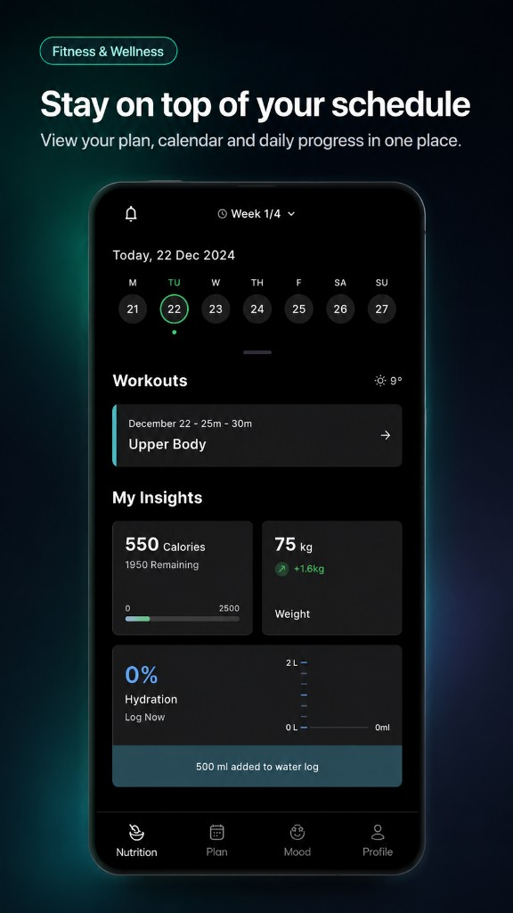
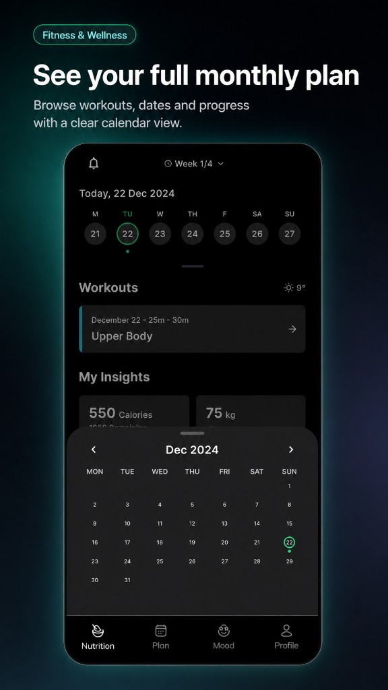
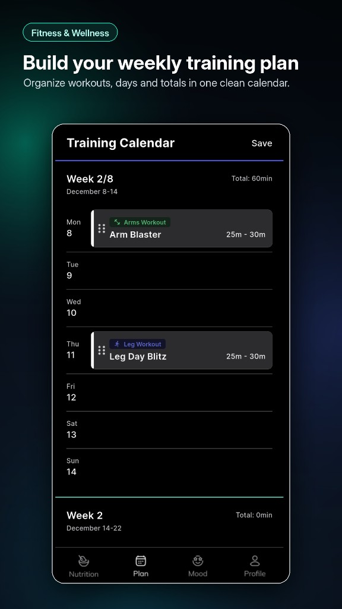
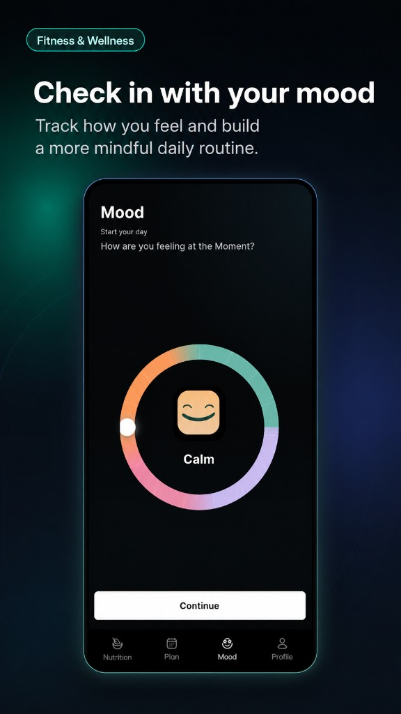
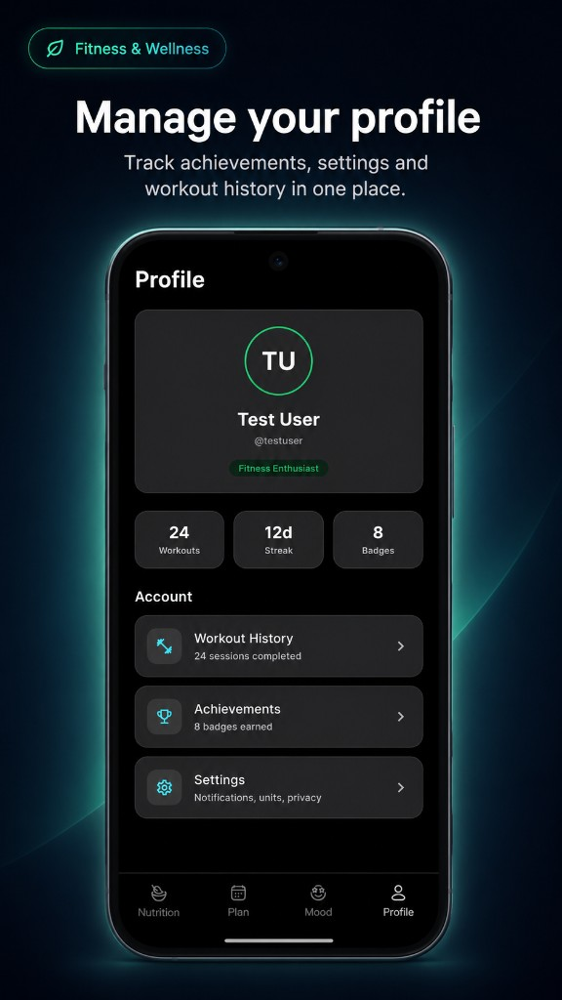

# test_app

Flutter interview test task — a dark-themed fitness & wellness app with Nutrition, Plan, Mood, and Profile tabs.

## 1. Dependencies Used & Why

### Runtime dependencies

| Package | Why it's used |
|---|---|
| `flutter` | Core Flutter SDK for building the UI. |
| `cupertino_icons` | iOS-style icons where needed alongside Material icons. |
| `provider` | Lightweight state management for tab selection, selected date, mood value, and hydration progress across screens. |
| `intl` | Date formatting and calendar labels in the date header and month calendar. |

Bundled **Inter** font files (`fonts/`) for consistent typography and faster app startup.

### Dev dependencies

| Package | Why it's used |
|---|---|
| `flutter_test` | Widget tests (e.g. verifying the nutrition screen loads). |
| `flutter_lints` | Enforces recommended Dart/Flutter lint rules. |
| `flutter_launcher_icons` | Generates Android and iOS launcher icons from `assets/app_icon/`. |
| `flutter_native_splash` | Generates native splash screens for Android and iOS. |

## 2. Project Structure

```
lib/
├── main.dart                 # App entry point, Provider setup, theme
├── models/                   # Data models (mood, workouts, insights, training)
├── screens/                  # Full-page UI (nutrition, plan, mood, profile, calendar)
├── services/                 # App state and mock data
├── utils/                    # Theme, colors, text styles, spacing
└── widgets/                  # Reusable UI components

assets/
├── app_icon/                 # Launcher icon source images
├── icons/                    # Bottom navigation icons
└── moods/                    # Mood face images for the mood selector

test/
└── widget_test.dart          # Basic widget test for app startup
```

### Folder details

- **`lib/models/`** — Plain Dart classes for app data: `MoodOption`, `Workout`, `InsightData`, training week/day models, etc.
- **`lib/screens/`** — Top-level screens wired into the bottom nav: `NutritionScreen`, `TrainingCalendarScreen`, `MoodScreen`, `ProfileScreen`, plus `MainShell` and `CalendarBottomSheet`.
- **`lib/services/`** — `AppState` (ChangeNotifier for shared UI state) and `MockDataService` (static mock data for workouts, insights, moods, and training plan).
- **`lib/utils/`** — Design tokens: `AppColors`, `AppTextStyles`, `AppSpacing`, and `AppTheme`.
- **`lib/widgets/`** — Shared components such as `AppBottomNavBar`, `WorkoutCard`, `InsightsSection`, `MoodSelector`, `MonthCalendar`, and `DateHeader`.

## 3. App Screenshots

| Nutrition | Calendar |
|:---:|:---:|
|  |  |

| Plan | Mood |
|:---:|:---:|
|  |  |

| Profile |
|:---:|
|  |

[View all screenshots](https://github.com/muhammadawaiscs/test-app-flutter/tree/main/screenshots)

## 4. App Video

[Watch App Demo Video](https://github.com/muhammadawaiscs/test-app-flutter/raw/main/docs/test-app-flow.mov)

## Getting Started

```bash
flutter pub get
flutter run
```
